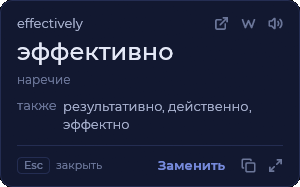
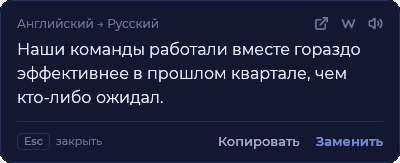
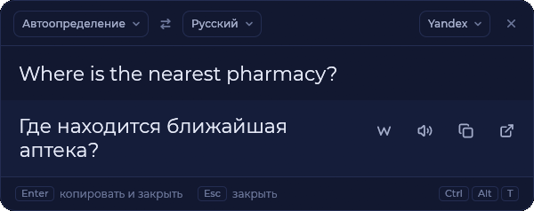
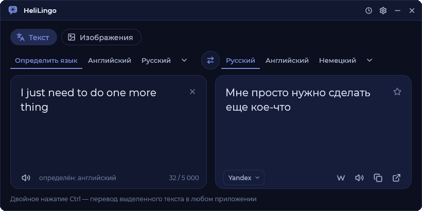
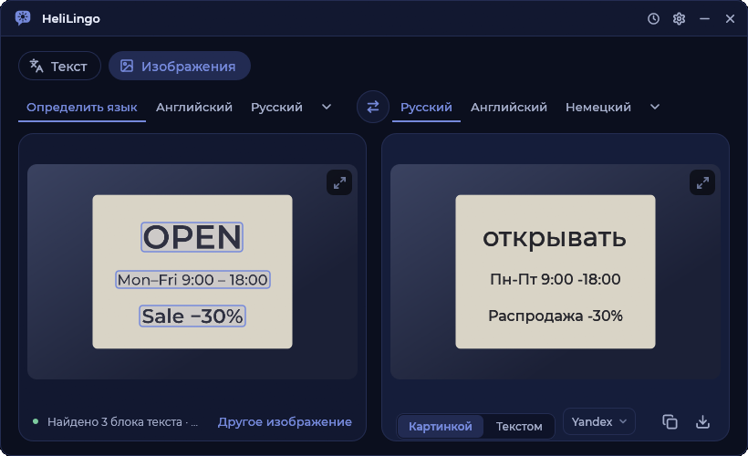
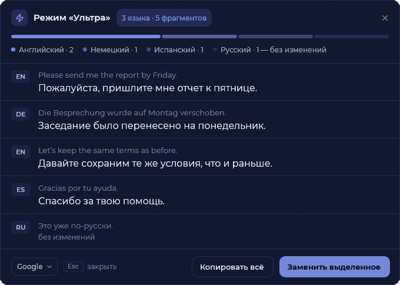
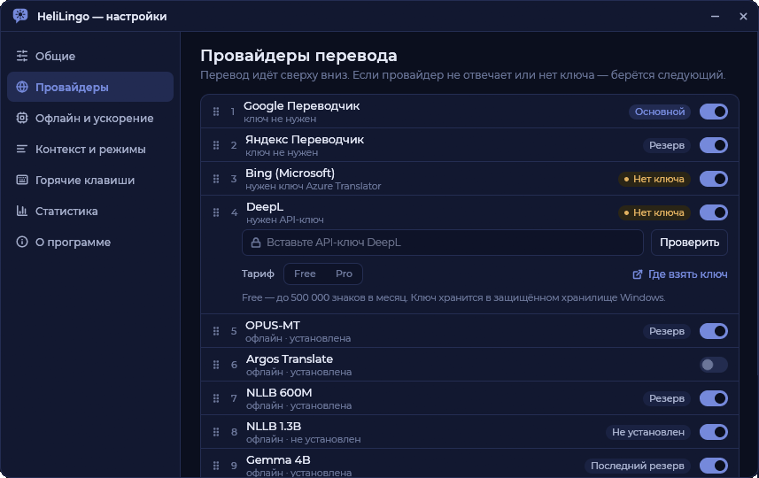

<p align="center">
  
</p>

<h1 align="center">HeliLingo</h1>

<p align="center">
  <b>Select text anywhere. Double-tap Ctrl. Read the translation.</b><br>
  A fast, native translator for Windows that lives in the tray.
</p>

<p align="center">
  <a href="README.ru.md">Русский</a> ·
  <a href="#features">Features</a> ·
  <a href="#download">Download</a> ·
  <a href="#build-from-source">Build</a> ·
  <a href="#shortcuts">Shortcuts</a>
</p>

<p align="center">
  
  
  
  
</p>

<p align="center">
  
  &nbsp;
  
</p>

---

## Features

- **Translate in place.** Select text in any app, double-tap **Ctrl**, and a popup appears next to it. It never takes focus, so your selection stays intact.
- **Replace with one click.** Swap the selected text for its translation straight in the source app; your clipboard is restored afterwards. Or use **Ctrl+Alt+R** to translate and paste with no window at all.
- **Pick a word or the whole sentence.** Click a word in the translation (Shift+click or drag for a run) and copy or replace just that part. Word popups show part of speech and alternatives.
- **Quick window** (**Ctrl+Alt+T**): type and the translation appears as you type.
- **Ultra mode** (**Ctrl+Alt+U**): a selection in several languages is split into fragments, each one detected and translated separately.
- **Images and screen areas.** Translate text in a picture, a screen area, a window or the whole monitor via Windows OCR.
- **Several providers with fallback.** Google and Yandex work without keys; Bing (Azure) and DeepL with your keys. If one fails, the next takes over.
- **Offline models.** OPUS-MT, Argos, NLLB-200 (600M / 1.3B) and TranslateGemma (4B / 12B) run on your PC, on the processor or the graphics card.
- **Programmer mode.** In source code, only string literals and comments are translated; the code stays byte for byte.
- **History, statistics, glossary**, Wikipedia summaries, text-to-speech, Russian and English interface.
- **Private by design.** API keys are encrypted with Windows DPAPI; history and statistics stay on your PC and can be turned off.

<p align="center">
  
</p>

<p align="center">
  
  
</p>

<p align="center">
  
  
</p>

## Download

Get `helilingo.exe` from the [latest release](https://github.com/Helisy420/HeliLingo/releases/latest) and run it: one file, no installation needed. The app appears in the system tray; settings are in `%APPDATA%\HeliLingo`.

## Build from source

### Requirements

| What | Why |
|---|---|
| **Windows 10 or 11**, x64 | The app uses Win32 and WinRT APIs |
| **[Rust](https://rustup.rs/)** (stable, 1.85 or newer, MSVC toolchain) | Edition 2024 |
| **[Visual Studio Build Tools](https://visualstudio.microsoft.com/visual-cpp-build-tools/)** with *Desktop development with C++* | MSVC linker and CMake |
| CMake | Builds CTranslate2 and SentencePiece for the offline models; the one bundled with the Build Tools is picked up automatically |

If your CMake is somewhere else, point to it before building:

```bash
set CMAKE=C:\path\to\cmake.exe
```

### Build and run

```bash
git clone https://github.com/Helisy420/HeliLingo.git
cd HeliLingo
cargo build --release
```

The result is `target\release\helilingo.exe`: a single file, statically linked, no runtime needed. The first build takes a while because CTranslate2 is compiled from source.

Optional: `cargo build --release --features offline-cuda` builds the offline models with CUDA (needs the CUDA toolkit).

## Shortcuts

All of them can be changed in Settings → Hotkeys. Any shortcut can also be a mouse side button (**Mouse 4** / **Mouse 5**).

| Shortcut | Does |
|---|---|
| Double-tap **Ctrl** | Translate the selection in a popup next to it |
| **Ctrl+Alt+T** | Quick window: translation as you type |
| **Ctrl+Alt+U** | Ultra mode on the selection |
| **Ctrl+Shift+S** | Translate a screen area or a window |
| **Ctrl+Shift+A** | Translate the whole monitor under the cursor |
| **Ctrl+Alt+Q** | Main translator window |
| **Ctrl+Alt+R** | Translate and paste: the selection is replaced by its translation |
| **Ctrl+C** twice | Translate what you just copied (like DeepL) |

Shortcuts are ignored while a fullscreen app (games, videos) or an app from the ignore list is in the foreground.

### In the popup

| Popup | Copy | Replace |
|---|---|---|
| **Word** | Copy icon copies the picked translation; click any alternative to pick it | **Replace** swaps your selection for the picked translation |
| **Sentence** | **Copy** copies everything; click or drag across words, then **Copy word(s)** | **Replace** uses the picked words, or the whole translation |
| **Compact** | Click the translation | Shift+click the translation |

`Esc` or a click elsewhere closes the popup; **Ctrl+C** while it is open copies the translation.

## Translation providers

Settings → Providers: drag to reorder, switch on and off. Each translation tries the enabled providers from the top and falls back to the next one on any error.

| Provider | Key |
|---|---|
| **Google** | Not needed (public web endpoints). Optional Google Cloud Translation key |
| **Yandex** | Not needed. Optional Yandex Cloud key |
| **Bing (Microsoft)** | Azure Translator key + region |
| **DeepL** | API key (Free keys ending in `:fx` work too) |
| **Offline models** | None: download them in Settings → Offline & acceleration |

Keys are stored only in `%APPDATA%\HeliLingo\settings.json`, encrypted with Windows DPAPI for your user account, and never logged.

## Where data lives

Everything is in `%APPDATA%\HeliLingo`:

| File | Contents |
|---|---|
| `settings.json` | Settings and encrypted keys |
| `history.json` | Translation history (up to 1000 entries, can be turned off) |
| `stats.json` | Local usage statistics (can be turned off) |
| `glossary.tsv` | Your glossary |

Offline models go to `%LOCALAPPDATA%\HeliLingo\Models` (configurable).

## For developers

```bash
cargo run -- --preview word        # also: sentence compact loading offline tray languages welcome
cargo run -- --preview quick       # also: ultra wiki main main-image main-image-result main-history capture
cargo run -- --preview settings-providers   # also: -hotkeys -stats -offline -modes -about
cargo run -- --translate "effectively" ru --provider google
cargo run -- --check deepl         # test the key from settings.json
```

Previews never write history or statistics.

<details>
<summary>Project layout</summary>

```
src/
  main.rs          entry point, CLI flags
  app.rs           state machine: hook → selection → engine → popup; tray, windows
  app/             Quick, Ultra, settings and main-window lifecycles
  translate/       provider chain, Google / Yandex / Bing / DeepL, languages, cache
  offline/         offline models: catalog, downloads, CTranslate2, llama.cpp
  ui/              popup, tray menu, settings, intro, quick, ultra, main window, widgets
  win/             Win32: hooks, clipboard, input, TTS, DPAPI, OCR, capture
  settings.rs      persisted preferences
  history.rs       translation history
  stats.rs         usage statistics
  code.rs          programmer mode
  wiki.rs          Wikipedia summaries
  i18n.rs          UI strings, Russian and English
  theme.rs         colours, Montserrat, egui style
assets/            icons, brand mark, Montserrat font
```

</details>

## Known limits

- Windows only.
- Around the synthetic copy and paste, only text, images, files, HTML and RTF are saved and restored on the clipboard.
- In terminals the app uses Ctrl+Insert / Shift+Insert, so a running process is never interrupted.
- Text-to-speech needs a Windows voice for the language; OCR needs the Windows language pack.
- Only the dark theme for now.

## Credits

- UI font: [Montserrat](https://fonts.google.com/specimen/Montserrat), SIL Open Font License (see [`assets/fonts/OFL.txt`](assets/fonts/OFL.txt)).
- Built with [egui](https://github.com/emilk/egui), [CTranslate2](https://github.com/OpenNMT/CTranslate2) via [ct2rs](https://github.com/jkawamoto/ctranslate2-rs), and [llama.cpp](https://github.com/ggml-org/llama.cpp).

<p align="center">
  Made by <a href="https://t.me/helisy">Helisy</a> · <a href="https://t.me/helisy420">Telegram</a> · <a href="https://github.com/Helisy420">GitHub</a>
</p>
